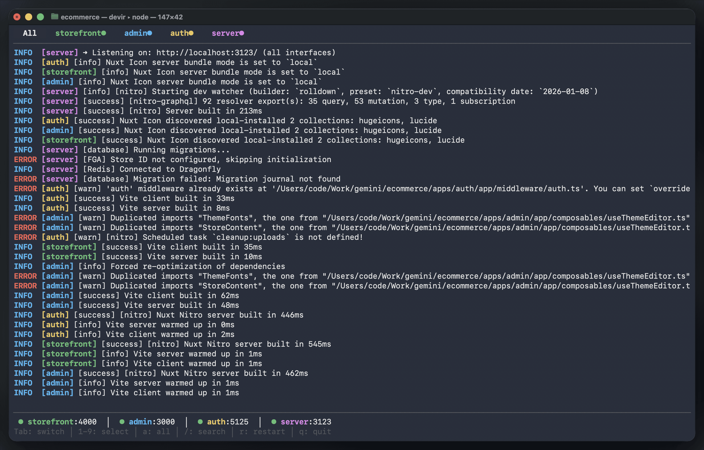

# Devir - Dev Runner CLI

A terminal UI for managing multiple dev services with colored logs, filtering, and MCP integration.

[](https://github.com/productdevbook/devir/actions/workflows/ci.yml)
[](https://github.com/productdevbook/devir/releases)
[](https://goreportcard.com/report/github.com/productdevbook/devir)
[](https://opensource.org/licenses/MIT)
[](https://go.dev/)

<p align="center">
  
</p>

## Features

- **Bubble Tea TUI** - Interactive terminal UI with tabs, viewport, and status bar
- **Colored Logs** - Each service has its own color for easy identification
- **Service Types** - Long-running, oneshot, interval, and HTTP request services
- **Custom Icons** - Emoji icons for services with dynamic status updates
- **Service Filtering** - View logs from all services or filter by specific service
- **Search** - Filter logs by text pattern
- **Port Management** - Detects ports in use and offers to kill them
- **MCP Server** - Integrate with Claude Code via Model Context Protocol
- **Daemon Mode** - Multiple TUI/MCP clients can connect to the same services

## Installation

### Quick Install (Recommended)

```bash
curl -fsSL https://raw.githubusercontent.com/productdevbook/devir/master/install.sh | bash
```

### Homebrew (macOS/Linux)

```bash
brew install productdevbook/tap/devir
```

### Manual Download

Download from [Releases](https://github.com/productdevbook/devir/releases)

| Platform | Download |
|----------|----------|
| macOS (Apple Silicon) | [devir-darwin-arm64.tar.gz](https://github.com/productdevbook/devir/releases/latest/download/devir-darwin-arm64.tar.gz) |
| macOS (Intel) | [devir-darwin-amd64.tar.gz](https://github.com/productdevbook/devir/releases/latest/download/devir-darwin-amd64.tar.gz) |
| Linux (x64) | [devir-linux-amd64.tar.gz](https://github.com/productdevbook/devir/releases/latest/download/devir-linux-amd64.tar.gz) |
| Linux (ARM64) | [devir-linux-arm64.tar.gz](https://github.com/productdevbook/devir/releases/latest/download/devir-linux-arm64.tar.gz) |
| Windows (x64) | [devir-windows-amd64.zip](https://github.com/productdevbook/devir/releases/latest/download/devir-windows-amd64.zip) |

### From Source

```bash
go install github.com/productdevbook/devir@latest
```

Or build manually:

```bash
git clone https://github.com/productdevbook/devir.git
cd devir
make build
```

## Usage

### TUI Mode (default)

```bash
# Start all default services
devir

# Start specific services
devir admin server

# With filters
devir --filter "error"
devir --exclude "hmr"
```

### MCP Server Mode

```bash
devir --mcp
```

### Daemon Mode

Devir uses a Unix socket daemon, allowing multiple clients (TUI or MCP) to connect to the same running services:

```bash
# Terminal 1: Start TUI (daemon starts automatically)
devir

# Terminal 2: Connect another TUI (same services, same logs)
devir

# Terminal 3: Connect via MCP (Claude Code controls same services)
devir --mcp
```

All clients share the same daemon and see the same logs in real-time. When Claude Code restarts a service, you'll see it immediately in your TUI.

### Keyboard Shortcuts

| Key | Action |
|-----|--------|
| `Tab` | Cycle through services |
| `1-9` | Select specific service |
| `a` | Show all services |
| `/` | Search logs |
| `c` | Copy logs to clipboard |
| `r` | Restart current service |
| `j/k` | Scroll up/down |
| `q` | Quit |

## Configuration

Create `devir.yaml` in your project root:

```yaml
services:
  admin:
    dir: apps/admin
    cmd: bun run dev
    port: 3000
    color: blue

  server:
    dir: server
    cmd: bun run dev
    port: 3123
    color: magenta

defaults:
  - admin
  - server
```

### Service Options

| Field | Description |
|-------|-------------|
| `dir` | Working directory (relative to config file) |
| `cmd` | Command to run |
| `port` | Port number (for status display) |
| `color` | Log prefix color: `blue`, `green`, `yellow`, `magenta`, `cyan`, `red`, `white` |
| `icon` | Custom emoji/icon for the service |
| `type` | Service type: `service` (default), `oneshot`, `interval`, `http` |
| `interval` | Run interval for `interval` type (e.g., `5s`, `1m`) |
| `url` | URL for `http` type |
| `method` | HTTP method for `http` type (default: `GET`) |
| `body` | Request body for `http` type |
| `headers` | Custom headers for `http` type |

## Service Types

Devir supports 4 different service types:

### `service` (default)
Long-running process. For web servers, APIs, etc.

```yaml
web:
  dir: apps/web
  cmd: npm run dev
  port: 3000
  icon: "🌐"
  color: blue
```

### `oneshot`
Run once and exit. For migrations, setup scripts, etc.

```yaml
migrate:
  type: oneshot
  dir: .
  cmd: npm run migrate
  icon: "⚙️"
  color: yellow
```

### `interval`
Run periodically. For health checks, cleanup jobs, etc.

```yaml
health:
  type: interval
  interval: 5s
  dir: .
  cmd: bash health.sh
  icon: "💓"
  color: green
```

### `http`
Make HTTP requests. For API calls, webhooks, etc.

```yaml
api-check:
  type: http
  url: https://api.example.com/health
  method: GET
  icon: "📡"
  color: magenta
```

With POST body:

```yaml
notify:
  type: http
  url: https://api.example.com/webhook
  method: POST
  body: '{"event": "started"}'
  headers:
    - "Authorization: Bearer token123"
  icon: "📤"
  color: cyan
```

## Status Symbols

| Symbol | Status | Description |
|:------:|--------|-------------|
| `●` | Running | Service is active |
| `✓` | Completed | Oneshot/HTTP completed successfully |
| `✗` | Failed | Service failed |
| `◐` | Waiting | Interval service waiting for next run |
| `○` | Stopped | Service is stopped |

## Dynamic Status

Services can dynamically update their icon and status by writing to `.devir-status` file in their directory:

```bash
# Simple - just icon
echo "🟢" > .devir-status

# JSON - icon + message
echo '{"icon": "🟢", "message": "All OK"}' > .devir-status

# JSON - full control
echo '{"icon": "🔴", "color": "red", "status": "failed", "message": "DB down!"}' > .devir-status
```

### Dynamic Status Fields

| Field | Description |
|-------|-------------|
| `icon` | Override icon with emoji or short text |
| `color` | Override service color |
| `status` | Override status: `running`, `completed`, `failed`, `waiting` |
| `message` | Status message (shown in MCP response) |

### Example: Health Check with Dynamic Status

```bash
#!/bin/bash
# health.sh
if curl -sf http://localhost:3000/health >/dev/null 2>&1; then
    echo '{"icon": "🟢", "message": "All systems operational"}' > .devir-status
    echo "Health OK"
else
    echo '{"icon": "🔴", "color": "red", "message": "Service down!"}' > .devir-status
    echo "Health FAIL"
fi
```

## MCP Integration

Add to your project's `.mcp.json`:

```json
{
  "mcpServers": {
    "devir": {
      "command": "devir",
      "args": ["--mcp"],
      "cwd": "/path/to/project"
    }
  }
}
```

> **Note:** Set `cwd` to the directory containing your `devir.yaml`. The daemon socket is unique per project directory, so multiple projects can run independently.

### Available MCP Tools

| Tool | Description |
|------|-------------|
| `devir_start` | Start services |
| `devir_stop` | Stop all services |
| `devir_status` | Get service status (includes type, icon, message) |
| `devir_logs` | Get recent logs |
| `devir_restart` | Restart a service |
| `devir_check_ports` | Check if ports are in use |
| `devir_kill_ports` | Kill processes on ports |

### MCP Status Response Example

```json
{
  "services": [
    {
      "name": "web",
      "running": true,
      "port": 3000,
      "type": "service",
      "status": "running",
      "icon": "🌐"
    },
    {
      "name": "health",
      "running": true,
      "type": "interval",
      "status": "waiting",
      "icon": "🟢",
      "message": "All systems operational",
      "runCount": 5
    }
  ]
}
```

## Development

```bash
# Build
make build

# Build for all platforms
make build-all

# Run tests
make test

# Lint
make lint
```

## Dependencies

- [Bubble Tea](https://github.com/charmbracelet/bubbletea) - TUI framework
- [Lip Gloss](https://github.com/charmbracelet/lipgloss) - Styling
- [MCP Go SDK](https://github.com/modelcontextprotocol/go-sdk) - MCP server

## License

MIT
